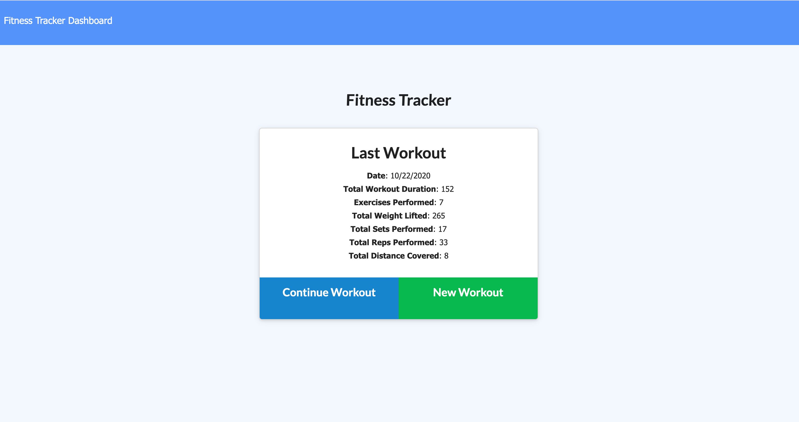
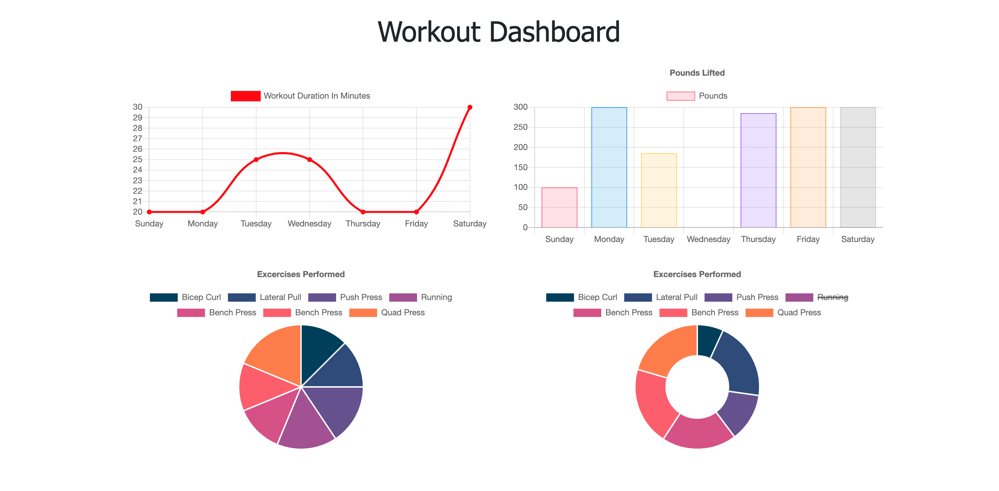

# Workout-Tracker

Welcome to my Workout Tracker application! This application allows users to view, create, and track their workouts on any given day. They can track the name, weight, sets, and reps of any resistance exercise. If the user completes a cardio exercise, they can track their distance traveled. 

## Usage
This app can be used by visiting the deployed application at https://joa-workout-tracker.herokuapp.com/. 

Once the application has loaded, you are are presented with your most recent workout and the option to continue the workout, or begin a new workout:

You can view your workout statistics by navigating to the workout dashboard:

## License
MIT 

## Contributing
If interested in contributing, please reach out to me directly via an email at jada.arnett@gmail.com. 
 
## Questions 
If you have any questions, please contact me directly at jada.arnett@gmail.com. 
